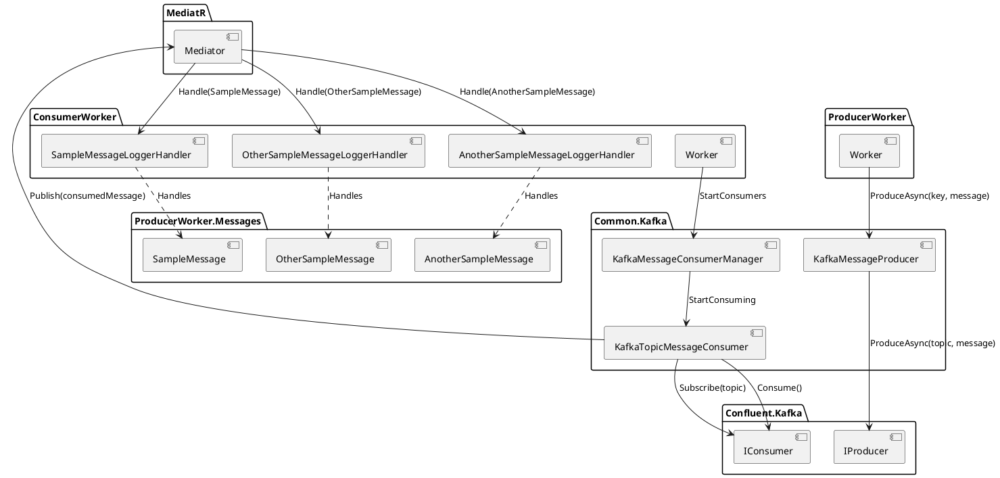
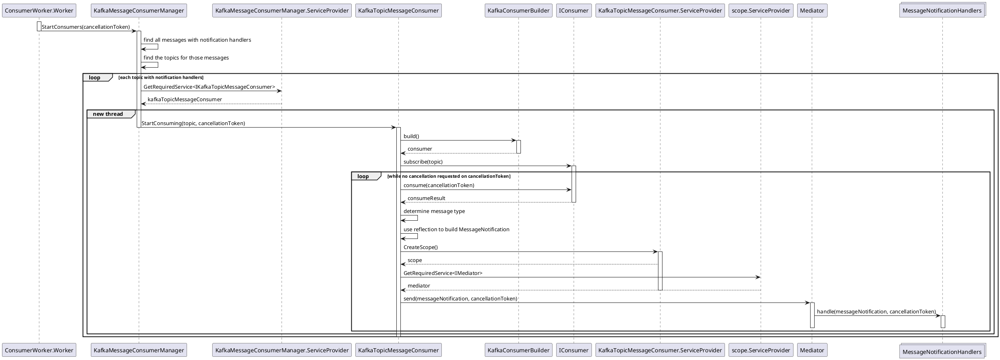

# Vertically sliced Event Driven Architecture with .NET Core and Kafka

## Purpose/Goal/Feeling/Scope

- Who is this for?
- Why write this?

As a developer I want to write business logic that reacts to events without needing to actively consider message transport specific concerns. This is not intended to remove all considerations of Kafka from developers writing event driven systems. The purpose is to enable the developer to choose what they want to focus on based on the work they are currently doing. It also allows the business logic to be tested in isolation from the messaging concerns through the clear separation of concerns.

## Intro

### A paragraph about EDA in intro?

When building event driven systems multiple services can react to a single event with each service focusing on its own specific requirements utilizing the infrastructure it owns. For example when a customer registers for an account, one service may record the customer details in its own datastore, while another may send out an email to welcome the customer. The two services involved in this business process handle separate concerns using different infrastructure to process the event. What is common between them though is that they both react to the same event. Since this is a common concern between the two services, handling this aspect consistently is important to ensure it is done correctly and to allow the developers of each service to not have to consider the needs of processing events when writing business logic that reacts to them.

In this post I will present an approach to standardizing the processing of events consumed from Kafka in .NET applications. The solution proposed does not cover complex event streaming applications, it is designed to support applications that receive events one at a time in order and then perform particular actions as reactions to that event.

It will be built as a shared library to ensure that both the producer and the consumer uses a consistent approach to publishing and consuming messages. Providing a shared library within an organisation that gives developers a consistent approach to react to events allows all of the cross cutting concerns to be handled consistently. It also improves developer productivity by allowing them to focus on the business logic required to handle that particular event. It also enables the reactions to the events to be handled independently making it easier to unit test, therefore increasing confidence in the quality of the code.

It makes adding new reactions to events straightforward, due to the consistent approach, independence of event handlers and automatic registration of the handlers. By automatically registering the handlers of events it allows a developer to focus purely on the code that will be reacting to the event without having to focus on the concerns of consuming that event. It makes it easier to add more services that listen to events and to also add more reactions within a given service for particular events.

The approach enables the consumer to be built using a vertical slice architecture where each event is handled by an independent handler with it's own dependencies injected within an isolated scope. This makes it easier to adopt a CQRS approach and the ability to test the handling of each event in isolation. Similar to ASP.NET Core where all HTTP requests are executed within their own dependency injection scope, each event will be processed within their own scope to ensure nothing is shared between events.

## Content

### Describe solution architecture





## The Solution - The Consumer

In the proposed solution to consume a message that is published to a Kafka topic a `MediatR.INotificationHandler<TNotification>` will be needed that subscribes to a `MessageNotification<TMessage>` type where `TMessage` is the concrete type of the message to be consumed. This handler will be automatically found and registered with a matching Kafka consumer that will listen to the topic it is published to.

This allows developers to easily add event handlers without worrying about messaging infrastructure concerns. It also makes writing handlers using TDD straightforward as all the tests will be purely focused on the business logic without any messaging specific concerns leaking into them.

```csharp
public class SampleMessageLoggerHandler : INotificationHandler<MessageNotification<SampleMessage>>
{
    private readonly ILogger<SampleMessageLoggerHandler> _logger;

    public SampleMessageLoggerHandler(ILogger<SampleMessageLoggerHandler> logger)
    {
        _logger = logger;
    }

    public Task Handle(MessageNotification<SampleMessage> notification, CancellationToken cancellationToken)
    {
        var message = notification.Message;

        _logger.LogInformation(
            $"Sample message received with key: {message.Key} and value: {message.SomeProperty}");

        return Task.CompletedTask;
    }
}
```

The type of the message has the properties that will be found on the serialised message and the topic that the message will be published to. The `MessageTopicAttribute` attribute will be used to define which topic the message is published to so the worker knows which topic to subscribe to.

```csharp
[MessageTopic("sample-messages")]
public class SampleMessage : IMessage
{
    public SampleMessage(string key, string someProperty)
    {
        Key = key;
        SomeProperty = someProperty;
    }

    public string Key { get; }

    public string SomeProperty { get; }
}
```

```csharp
[AttributeUsage(AttributeTargets.Class)]
public class MessageTopicAttribute : Attribute
{
    public MessageTopicAttribute(string topic)
    {
        Topic = topic;
    }

    public string Topic { get; }
}
```

The `MessageNotification<TMessage>` class is a wrapper that encapsulates the deserialized consumed message along with any other properties that could be relevant to processing that message e.g. key, headers, correlation ID. It implements the `MediatR.INotification` to allow `MediatR.INotificationHandler<TNotification>` handlers to be written that subscribe to that notification.

```csharp
public class MessageNotification<TMessage> : INotification
    where TMessage : IMessage
{
    public MessageNotification(TMessage message)
    {
        Message = message;
    }

    public TMessage Message { get; }
}
```

### What happens behind the scenes to make a handler work?

The core of the solution to the consumer worker is the `KafkaMessageConsumerManager` which is responsible for using reflection to scan the registered message notification handlers.

```csharp
private static IEnumerable<string> GetTopicsWithNotificationHandlers(IServiceCollection services)
{
    var messageTypesWithNotificationHandlers = services
        .Where(s => s.ServiceType.IsGenericType &&
                    s.ServiceType.GetGenericTypeDefinition() == typeof(INotificationHandler<>))
        .Select(s => s.ServiceType.GetGenericArguments()[0])
        .Where(s => s.IsGenericType &&
                    s.GetGenericTypeDefinition() == typeof(MessageNotification<>))
        .Select(s => s.GetGenericArguments()[0])
        .Where(s => typeof(IMessage).IsAssignableFrom(s))
        .Distinct();

    return messageTypesWithNotificationHandlers
        .SelectMany(t => Attribute.GetCustomAttributes(t))
        .OfType<MessageTopicAttribute>()
        .Select(t => t.Topic)
        .Distinct()
        .ToList();
}
```

It uses the results of the scan to determine what topics have registered handlers so it can then start a new thread with a new `KafkaTopicMessageConsumer` for each of those topics. This ensures each topic has a dedicated consumer running in an independent thread to ensure multiple topics can be consumed concurrently.

The `CancellationToken` passed into the method is the token that the worker receives to represent a request to stop the application which could happen as a request by the user in an interactive terminal using CTRL+C or it can be due to the scheduler running the application requesting it to shut down e.g. Kubernetes stopping the running pod.

```csharp
public void StartConsumers(CancellationToken cancellationToken)
{
    var topicsWithNotificationHandlers = GetTopicsWithNotificationHandlers(_services);

    foreach (var topic in topicsWithNotificationHandlers)
    {
        var kafkaTopicMessageConsumer = _serviceProvider.GetRequiredService<IKafkaTopicMessageConsumer>();

        new Thread(() => kafkaTopicMessageConsumer.StartConsuming(topic, cancellationToken))
            .Start();
    }
}
```

The `KafkaTopicMessageConsumer` is responsible for building a new consumer and then subscribing to the topic with that consumer. It will then continuously request to consume a message from the Kafka topic until the cancellation token requests a cancellation.

For each message it receives it will read the `message-type` header which is a custom header set by the producer to determine the `C#` type of the serialized message in the body. Once it determines the type it deserializes it using `JSON.NET` and then creates a new `MessageNotification<TMessage>` instance using reflection which is a wrapper class that encapsulates the deserialized message. This allows multiple message types to be consumed from the same topic.

A new dependency injection scope is then created to ensure all scoped dependencies that are used in processing the message are not shared between the processing of other messages. Using this new scope it requests an instance of MediatR which it then uses to publish the `MessageNotification<TMessage>` instance to all registered notification handlers.

It publishes the message to MediatR synchronously waiting for it to finish running all of the handlers for that particular message to ensure that each message is fully processed before the next message in the topic is processed.

```csharp
public void StartConsuming(string topic, CancellationToken cancellationToken)
{
    using (var consumer = _kafkaConsumerBuilder.Build())
    {
        _logger.LogInformation($"Starting consumer for {topic}");
        consumer.Subscribe(topic);

        try
        {
            while (!cancellationToken.IsCancellationRequested)
            {
                var consumeResult = consumer.Consume(cancellationToken);

                var messageTypeEncoded = consumeResult.Message.Headers.GetLastBytes("message-type");
                var messageTypeHeader = Encoding.UTF8.GetString(messageTypeEncoded);
                var messageType = Type.GetType(messageTypeHeader);

                var message = JsonConvert.DeserializeObject(consumeResult.Message.Value, messageType);
                var messageNotificationType = typeof(MessageNotification<>).MakeGenericType(messageType);
                var messageNotification = Activator.CreateInstance(messageNotificationType, message);

                using (var scope = _serviceProvider.CreateScope())
                {
                    var mediator = scope.ServiceProvider.GetRequiredService<IMediator>();
                    mediator.Publish(messageNotification, cancellationToken).GetAwaiter().GetResult();
                }
            }
        }
        catch (OperationCanceledException)
        {
            // do nothing on cancellation
        }
        finally
        {
            consumer.Close();
        }
    }
}
```

## The Solution - The Producer

The `KafkaMessageProducer` class in the proposed solution is a simple singleton class that takes the instance of the message to be published, determines the topic it will be published to, serializes it then publishes it to the Kafka topic. It is responsible for ensuring a single instance of the Kafka producer is built using the Lazy pattern as it is expensive to build them and it is safe to use a single shared instance for the lifetime of the application.

The `message-type` header is set with the name of the message type to allow the consumer on the other end to determine how to deserialize and consume it. The `MessageTopicAttribute` is used to determine the topic of the message to be published. This restricts a particular message type to be published to a single topic, while allowing multiple message types to be published to a single topic. It is possible to move the configuration for a message type's topic outside of the class to allow it to be published to multiple topics if required.

```csharp
public class KafkaMessageProducer : IMessageProducer, IDisposable
{
    private readonly Lazy<IProducer<string, string>> _cachedProducer;

    public KafkaMessageProducer(IKafkaProducerBuilder kafkaProducerBuilder)
    {
        _cachedProducer = new Lazy<IProducer<string, string>>(() => kafkaProducerBuilder.Build());
    }

    public void Dispose()
    {
        if (_cachedProducer.IsValueCreated) _cachedProducer.Value.Dispose();
    }

    public async Task ProduceAsync(string key, IMessage message, CancellationToken cancellationToken)
    {
        var serialisedMessage = JsonConvert.SerializeObject(message);
        var topic = Attribute.GetCustomAttributes(message.GetType())
            .OfType<MessageTopicAttribute>()
            .Single()
            .Topic;

        var messageType = message.GetType().AssemblyQualifiedName;
        var producedMessage = new Message<string, string>
        {
            Key = key,
            Value = serialisedMessage,
            Headers = new Headers
            {
                {"message-type", Encoding.UTF8.GetBytes(messageType)}
            }
        };

        await _cachedProducer.Value.ProduceAsync(topic, producedMessage, cancellationToken);
    }
}
```

## Sample Application

In the [sample application](https://github.com/gabrielsadaka/dotnet-kafka-sample) there is a common library that contains the code to communicate to Kafka for both consumers and producers. This enables all producers and consumers to use a consistent approach to ensure all messages can be published and then consumed with confidence. It also allows new services to be developed without needing to worry about the Kafka specific concerns. Ideally in an organisation there will be a platform team that is responsible for maintaining the Kafka producer and consumer shared libraries so there is a standard approach across the entire organisation.

The common library has a single entry point for both consumers and producers that register all of the necessary dependencies using the Microsoft Dependency Injection abstractions. It also uses a common class that represents the configuration options that are required to connect to Kafka.

There is a .NET Core worker for the Consumer which leverages the shared DI setup from the `Common.Kafka` library. It has 3 notification handlers, one for each message published by the producer.

```csharp
public static IHostBuilder CreateHostBuilder(string[] args)
{
    return Host.CreateDefaultBuilder(args)
        .ConfigureServices((hostContext, services) =>
        {
            services.AddHostedService<Worker>();

            services.AddOptions<KafkaOptions>()
                .Bind(hostContext.Configuration.GetSection("Kafka"));

            services.AddKafkaConsumer(typeof(Program));
        });
}
```

There is a .NET Core worker for the Producer which leverages the shared DI setup from the `Common.Kafka` library. It publishes 3 separate messages, two of which that are published to the same topic every second. This shows that multiple message types can be published to the same topic while being consumed be independent handlers.

```csharp
public static IHostBuilder CreateHostBuilder(string[] args)
{
    return Host.CreateDefaultBuilder(args)
        .ConfigureServices((hostContext, services) =>
        {
            services.AddHostedService<Worker>();

            services.AddOptions<KafkaOptions>()
                .Bind(hostContext.Configuration.GetSection("Kafka"));

            services.AddKafkaProducer();
        });
}
```

Each producer has its own library that has the types of the messages that will be published allowing consumers to reference these libraries without having to depend directly on the producer. An alternative approach is to use Confluent Schema Registry to store the message schemas which provides a central place for producers and consumers to ensure they are adhering to the latest schema. Using the Confluent Schema Registry will require a schema type that supports multiple message types per topic in .NET which at time of writing is only Avro.

Both the Producer worker and the Consumer worker each have a basic `Dockerfile` that builds and starts them. They are then connected to each other along with a single Kafka broker and ZooKeeper instance using Docker Compose which enables the sample to be run locally without any external dependencies to be setup. It uses automatic topic creation to simplify the setup, however in a production environment this is not recommended.

## Consistent handling of cross cutting concerns

Having a consistent approach to producing and consuming messages enables cross cutting concerns to also be handled consistently. The sample application does not implement this, however it can be extended to support the [Interceptor pattern](https://en.wikipedia.org/wiki/Interceptor_pattern) which will allow different steps of the message processing to be intercepted to handle various cross cutting concerns.

To handle common production support scenarios interceptors can be developed to provide context about the events that are processed. A logging interceptor could be developed that produces a log message with the type and key of every message consumed, or a metrics interceptor that records the time each event takes to process. To enable distributed tracing a correlation ID propagator interceptor could be developed to parse the incoming correlation ID and store it in a scoped dependency which can then be used to propagate to downstream API calls or events raised.

The sample application does not currently handle exceptions that are raised while processing messages, so an exception handler can be developed as an interceptor to solve this problem. Depending on the specific application, one could simply log and skip the message being processed if an error occurs or could halt the entire worker or publish the message to a dead letter queue.

An interceptor can be developed to handle authorisation by blocking the processing of messages that fail authorisation checks. An example is an interceptor that confirms that the incoming message has an authorisation token with the claims that are required to perform the particular action.

## Libraries

### Confluent Kafka .NET Client

The [Confluent Kafka .NET Client](https://docs.confluent.io/current/clients/dotnet.html) is used to communicate with Kafka for both the producer and the consumer code. It is an open source library that is supported by Confluent which is a well recognized commercial provider supporting Kafka. They also provide the docker images that are used within the sample application that enable it to be run consistently on any machine that has docker compose installed.

### MediatR

In the sample application the [MediatR](https://github.com/jbogard/MediatR) .NET library is used to implement the mediator pattern which is responsible for passing the `MessageNotification<TMessage>` instance to the correct `INotificationHandler<TNotification>`. It is a simple open source battle tested library that is commonly used in the .NET ecosystem with support for all major dependency injection frameworks.

Since it is a simple implementation it does not support complex scenarios, such as filtering handlers based on attributes which could enable more use cases if necessary. Therefore it is recommended to implement the mediator pattern from scratch if `MediatR` does not the use cases required.

## Alternative Approaches

There are a number of alternative approaches to the one outlined in the sample application that can be adopted depending on the needs of the applications that will be producing and consuming events to and from Kafka.

### Attribute on handle method

An alternative approach to defining the topic for the message is to apply the attribute to the `Handle` method of the handler that is handling the message rather than the message class itself. This allows a single message type to be published to multiple topics and therefore be consumed from multiple topics.

Using this approach within the sample application will require either building a custom mediator or extending MediatR to support filtering the handler based on the attributes of the `Handle` method for the particular message type. The [Spring Kafka](https://spring.io/projects/spring-kafka) framework for Java uses this approach where the method is annotated with a [@KafkaListener](https://docs.spring.io/spring-kafka/docs/2.5.4.RELEASE/reference/html/#kafka-listener-annotation) annotation that has a variety of possible configuration options. This will increase the complexity of `KafkaMessageConsumerManager` and `KafkaTopicMessageConsumer` as the manager will need to know how to find attributes on the `Handle` method while the consumer will need to selectively call handlers based on the parameters of the attribute. 

## Conclusion

There are a number of ways to evolve the proposed solution to handle more complex scenarios or to enable more robust error handling. I will be exploring ways to evolve the solution myself however it would be great to hear from others about what ideas they may have.

Building event driven applications is a complex endeavour so it is important to ensure that the core aspects that are relevant to the systems being built are handled in a consistent manner. This approach provides a starting point to build a framework that addresses those concerns.

Please refer to my [Github repository](https://github.com/gabrielsadaka/dotnet-kafka-sample) for the sample application.